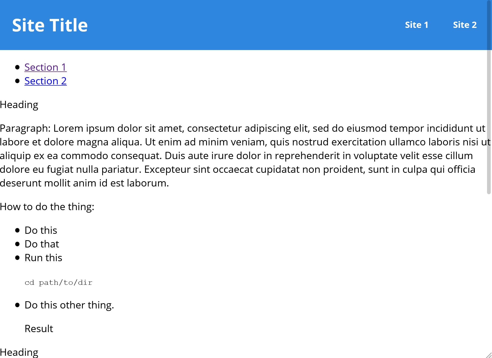

# 100 Days Of Code - Log

### Day 1: October 27, 2020
**Today's Progress**: Applied styles to Michelle Obama tribute page in FCC
responsive web design challenge.

**Thoughts:** This is fun! And it really is hard to stop once you get going.

**Link to work:**
[Today's PR](https://github.com/newwebash/fcc-tribute-page/pull/5)

### Day 2: October 28, 2020

**Today's Progress**: Applied more styles to Michelle Obama tribute page, also
fixed some typos. I copied the code into a Codepen and linked to it from my
repo's readme.

**Thoughts**: This is really fun! This first coding challenge is pretty simple
though. Actually, I considered adding more flourishes to the site but thought
it just didn't fit the challenge brief.

**Link(s) to work**:

1. [Updated readme](https://github.com/newwebash/fcc-tribute-page)
2. [PR 7](https://github.com/newwebash/fcc-tribute-page/pull/7) and [PR 5](https://github.com/newwebash/fcc-tribute-page/pull/5)
3. [Live site on Codepen](https://codepen.io/NewWebAsh/pen/MWerNqq)

### Day 3: October 29, 2020

**Today's Progress**: Started working on the Survey Form challenge.

**Thoughts**: It's been awhile since I last created an HTML form. It's like
riding a bike - I just have to glance at the documentation for a refresher on
things, but it's all coming back.

**Link(s) to work**
1. [Source code in new repo](https://github.com/newwebash/fcc-survey-form)

**Screenshot**

Here's where I left off today:

### Day 4: October 30, 2020

**Today's Progress**: Finished the user stories in FCC's
[Responsive Web Design Projects - Build a Survey Form](https://www.freecodecamp.org/learn/responsive-web-design/responsive-web-design-projects/build-a-survey-form)

**Thoughts** Today was slower than previous days. I got stuck on
trying to style the checkboxes in my form. I found some advice on the w3schools
site, as well as on Stack Overflow, but wasn't able to successfully style the
checkboxes as I had wanted to.

I also asked in FCC Discord and the person who
responded reaffirmed that these are notoriously difficult to manage with CSS.

So after awhile I moved on without applying the styles I had wanted.

**Link(s) to work**: https://github.com/newwebash/fcc-survey-form/pull/3

### Day 5: October 31, 2020

**Today's Progress**: Went through FreeCodeCamp lessons on CSS Flexbox and CSS
grid. I experimented with applying the material to my site but didn't merge
any code.

**Thoughts**: I've used this stuff before but it's been awhile, so it's good
to review. I think that layout is the toughest part about CSS, in my experience.

### Day 6: November 1, 2020

**Today's Progress**: Adjusted survey form layout using CSS grid but it looks
pretty buggy and needs more work.

**Thoughts**: On the one hand, I'm a little frustrated that CSS layouts are so
hard to get right, but glad that I'm focusing my attention here so I can level
up.

**Link(s) to work**: Today's [PR](https://github.com/newwebash/fcc-survey-form/pull/5)

### Day 7: November 2, 2020

**Today's Progress**: Made lots of progress on adjusting layout using a combo
of CSS grid and flexbox! I'm pretty much done with this challenge. I just need
to make some adjustments to my HTML markup before I can submit it.

**Thoughts**: This was fun! I'm glad I was able to overcome the layout challenges
I encountered after some more effort!

**Link(s) to work**:
1. [Source code in CodePen](https://codepen.io/NewWebAsh/pen/GRqdweX)

**Screenshot**

Here's the finished layout on a large screen:

### Day 8: November 3, 2020

**Today's Progress**: I made a few last changes to my survey form to be able
to pass the automated tests by FCC. The only noticeable user-facing change
is that the last input field is now a `<textarea>` instead of `<input>`.

I also started working on the next FCC Code challenge to create a [product
landing page](https://www.freecodecamp.org/learn/responsive-web-design/responsive-web-design-projects/build-a-product-landing-page).

**Thoughts**: Since this challenge includes using a few different images as
well as a video, there's some risk of getting sidetracked. For example, I
spent maybe 10 minutes creating a logo for a fictional business.

I'm also not feeling 100% today, so I feel a little slow getting things going.

**Link(s) to work**: First commit to new repo: https://github.com/newwebash/fcc-product-landing-page/commit/41df22410e9d22381b1ee710e3451653c28f7019

### Day 9: November 4, 2020

**Today's Progress**: Finished adding minimum required html elements to landing
page and also started adding CSS.

**Thoughts**: CSS can be so finicky and frustrating sometimes! I'm also trying
to think of ways I can work more quickly. However, I also see value in taking my
time with these basic front-end projects so I can use them as building blocks
for future projects.

**Link(s) to work**: Today's [latest PR](https://github.com/newwebash/fcc-product-landing-page/commit/7d40df14f5dffea1deaeb84b1847fc854dd906c8)

### Day 10: November 5, 2020

**Today's Progress**: Was able to fix some spacing issues in the site for
mobile, and made lots of progress on the nav bar for mobile.

**Thoughts**: Although I felt frustrated yesterday, I got a rush from making
so much progress today!

**Link(s) to work**: Today's [latest commit](https://github.com/newwebash/fcc-product-landing-page/commit/b3b6ad4e8ba03152d686fba2348bfdd5fc46775b)

### Day 11: November 6, 2020

**Today's Progress**: I more or less finalized the header nav on mobile, then
moved on to format the intro section and am starting to work on the "Our Classes"
section.

**Thoughts**: Same as in previous days, I fluctuate between being frustrated
with CSS layouts and then feeling very rewarded once I get it working the
way I want, and it looks great!

**Link(s) to work**: Today's [PR](https://github.com/newwebash/fcc-product-landing-page/pull/4)

### Day 12: November 7, 2020

**Today's Progress**: Finished the basic layout for small mobile screens. There's
a bit more styling to do to smooth out the rough edges, but it's pretty good
as of now!

**Thoughts**: It's so exciting to see things coming together!

**Link(s) to work**: Day's [PR](https://github.com/newwebash/fcc-product-landing-page/pull/6)

### Day 13: November 8, 2020

**Today's Progress**: Made a few minor adjustments to small mobile styles and
started working on layout for mid-size screens.

**Thoughts**: It felt like I spent lots of time working with CSS and getting
nowhere. The site was just super finicky and broken on a larger screen and
every adjustment I made had unintended effects. I decided after awhile to take
a break, clear my head, and hopefully see it with a fresh set of eyes tomorrow morning.

**Link(s) to work**: Today's [PR](https://github.com/newwebash/fcc-product-landing-page/pull/7)

### Day 14: November 9, 2020

**Today's Progress**: Made progress on adjusting layout for mid-size screen.
First I started working with CSS grid but scrapped that in favor of flexbox.

I'd like to keep working on this more but have to stop since I've got a busy
morning!

Screenshot of section that went well today:

**Thoughts**: Again, it feels like two steps forward and one step back. Still,
I'm happy with the net one step made forward!

**Link(s) to work**: Today's [PR](https://github.com/newwebash/fcc-product-landing-page/pull/7)

### Day 15: November 10, 2020

**Today's Progress**: Finished layout for pricing section on larger mobile screen.

**Thoughts**: I didn't have much time to work on this today due to other
priorities. I'm glad I was able to spend an hour working on this but I really
need more time to focus in order to make progress.

**Link(s) to work**: Today's [PR](https://github.com/newwebash/fcc-product-landing-page/pull/8)

### Day 16: November 11, 2020

**Today's Progress**: Finished layout for contact form and footer. Also adjusted
global styles for contact form fields.

**Thoughts**: At this point it feels like I'm losing time just making minor
tweaks trying to get the layout right. Are there any tips out there for how
to work more efficiently? I think if I could do it over again, I'd create one
empty starter section with just numbered boxes with different background colors,
adjust and harden the layout for different screen sizes, then go back and
duplicate that initial pattern for each new section of the landing page, then
go back and fill in the different sections as needed. I had tried to build in
certain structure patterns in the different sections as I initially started
building out this landing page, but it seems to have backfired. The CSS file
is now so long and the intermingling of different classes, etc. . .is complex
and unwieldy, it seems like I fix one thing and another thing breaks.

Anyway, at least I'm learning from this and can experiment with my idea next
time I build a site.

**Link(s) to work**: Today's [PR](https://github.com/newwebash/fcc-product-landing-page/pull/9)

### Day 17: November 12, 2020

**Today's Progress**: Tested and debugged CSS for small and mid-size screens.
The results aren't perfect, but they're good enough for now. Some more polish
will be needed after I do the layout for larger screens, anyway.

**Thoughts**: Same as other days: CSS can be both fun and frustrating.

**Link(s) to work**: Today's [PR](https://github.com/newwebash/fcc-product-landing-page/pull/10)

### Day 18: November 13, 2020

**Today's Progress**: Started formatting for larger screens / desktop.

**Thoughts**: I'm getting anxious to finish this project so I can move on to
try my hand at some new skills. But on the other hand I want to make sure this
one's high-quality, so I'll take the time that I need.

**Link(s) and screenshots**:

1. Screenshot above the fold:

   

2. Screenshot below the fold:

   

3. Today's [PR](https://github.com/newwebash/fcc-product-landing-page/pull/12)

### Day 19: November 14, 2020

**Today's Progress**: I  believe I'm done with all significant layout styles!!!
Tomorrow I want to go through and make sure all of the project user stories are
complete, and do some (hopefully) final testing before I can submit this project
and move on to the next one!

**Thoughts**: I'm so glad I switched to Firefox dev tools - no offense but the
dev console in FF was way more helpful than the one in Chrome, at least for
CSS Flexbox.

**Link(s) to work**: Today's [PR](https://github.com/newwebash/fcc-product-landing-page/pull/13)

### Day 20: November 15, 2020

**Today's Progress**: I made a few changes to my html markup to improve
accessibility. I also imported my source code into Codepen and ran the tests
provided by FreeCodeCamp. I failed most of the tests but this seems to be
related to other html markup requirements. I don't think it should be too
big of a lift to make the fixes to pass those tests.

**Thoughts**: Happy to be close to finishing this project!

**Link(s) to work**: My project in [Codepen](https://codepen.io/NewWebAsh/full/GRqeRbb)

### Day 21: November 16, 2020

**Today's Progress**: Modified HTML markup to pass automated tests, also
modified css based on feedback from CSS Linter.

**Thoughts**: It's a great day!

**Link(s) to work**: My updated project [readme](https://github.com/newwebash/fcc-product-landing-page#fcc-product-landing-page)

### Day 22: November 17, 2020

**Today's Progress**: Started refactoring CSS based on DRY principle and to avoid
linking styles to IDs.

**Thoughts**: About a week ago I expressed the need to find ways to work more
efficiently. I had an aha! moment yesterday when I linted my CSS. Now I have
better ideas about how to code my CSS more efficiently, but before I move onto
the next project, I've decided to refactor the CSS in this landing page site.

It's a bit disappointing that I can't move on to the next challenge yet, but
I want my portfolio samples to be ironclad, so it's worth taking a bit more time
to make sure this one's correct.

**Link(s) to work**: Today's [PR](https://github.com/newwebash/fcc-product-landing-page/pull/17)

### Day 23: November 18, 2020

**Today's Progress**: Finished refactoring CSS to avoid linking styles
to IDs.

**Thoughts**: I could stand to do more style consolidation based on the DRY principle,
but want to avoid getting stuck on this project for too long. I'm itching to
move on to the next one! And I think that now I'm in a better position to be
proactive about best practices like DRY from the beginning as I move on to the
next project.

**Link(s) to work**: Today's [PR](https://github.com/newwebash/fcc-product-landing-page/pull/18)

### Day 24: November 19, 2020

**Today's Progress**: Set up basic HTML elements for my tech docs page and
started styling the main site header.

Doesn't look like much yet but it's always fun to see the before and after:

I'm trying to follow the guidelines in this article: [BEM for Beginners](https://www.smashingmagazine.com/2018/06/bem-for-beginners/)

**Thoughts**: This is fun!

**Link(s) to work**: Today's [PR](https://github.com/newwebash/fcc-tech-docs-page/pull/2)

### Day 25: November 20, 2020

**Today's Progress**: Made lots of progress on styling the nav. I also created
a stylesheet for the main section but the styling is broken.

**Thoughts**: So far I'm finding the BEM method for organizing my stylesheets
very helpful!

**Link(s) to work**: Today's [PR](https://github.com/newwebash/fcc-tech-docs-page/pull/3)

### Day 26: November 21, 2020

**Today's Progress**: Changed main element positioning using flexbox. Site is
more or less complete, at least according to the required user stories.

**Thoughts**: It's a relief to fix those pesky layout issues!

### Day 27: November 22, 2020

**Today's Progress**: Finished technical documentation site project!

**Thoughts**: There's of course more that I could do to make this a fully-fledged
site rather than just a simple page. But I'd really like to move on to other
projects, so now that I have an MVP for this project I'll move on to JavaScript
projects for now.

**Link(s) to work**:

1. See the site on [Codepen](https://codepen.io/NewWebAsh/pen/oNLRoPW?editors=0100).
2. Screenshot:

   

### Day 28: November 23, 2020

**Today's Progress**: I haven't merged any code today but I have done lots of
work! I've been working on migrating my product landing page to WordPress,
following this [Smashing Magazine article](https://www.smashingmagazine.com/2013/05/migrate-existing-website-to-wordpress/).

**Thoughts**: It feels risky going off the rails and exploring WordPress instead
of the FCC curriculum. But I just can't help but wonder if I can get to a
Minimum Viable Developer status faster if I'm able to develop and deploy custom
sites and then hand them over to customers to edit content on their own.

I think with my knowledge and experience, it shouldn't take too much to be able
to pull this off. On the one hand, I don't know PHP but on the other hand,
I already made lots of progress today and what I'm seeing on the backend looks
relatively similar to what I've seen when working with static site generators.

**Link(s) to work**: I haven't merged any code today, and the dev work I'm doing
so far is on my local server.

### Day 29: November 24, 2020

**Today's Progress**: Since yesterday I started having to work with PHP, and
since I have no PHP experience, I decided today to start a Lynda course called
PHP Essential Training. I've just finished the lesson that covers variables.

**Thoughts**: I feel a little anxious still going off track from the FCC
curriculum to learn about PHP. I hope it doesn't slow me down!

**Link(s) to work**: I've created [this repo](https://github.com/newwebash/php_essentials)
to host my course files.

### Day 30: November 25, 2020

**Today's Progress**: Continued working through PHP Essentials course, mostly
just learning basic syntax.

**Thoughts**: It's true that when you learn one technology, it helps you
transfer that knowledge to other technologies. PHP syntax is pretty easy given
that it's just a different flavor of many of the things I've already learned
through my C and Java courses.

### Day 31: November 27, 2020

**Today's Progress**: Well, I've got news! I decided to pivot yet again and
start learning Vue.js. I'm learning it by following a Lynda course, since
Vue's not covered in the FCC curriculum.

**Thoughts**: This is exciting! I feel like I'm able to grasp this easily and
am thinking of how I could implement it for my own app!

**Link(s) to work**: Today's [PR](https://github.com/newwebash/learning-vuejs/pull/1)

### Day 32: November 28, 2020

**Today's Progress**: Continued Vue.js course. I also got inspired by the
course content to add some smooth-scroll functionality to my product landing page!

**Thoughts**: It was hard to make time for coding today. I'm excited to have made
it through my first month of 100 days of code! But some days are hard, when you're
busy and not sure if you'll have enough time for it that day. Plus I'm just very
tired!

**Link(s) to work**:

1. Updates from latest Vue.js lessons - [PR](https://github.com/newwebash/learning-vuejs/pull/2)
2. Use jQuery to implement smooth scroll - [PR](https://github.com/newwebash/fcc-product-landing-page/pull/19)

### Day 33: November 29, 2020

**Today's Progress**: Almost finished Vue course. Based on what I've learned so
far, I've started converting my tech docs theme last week to a Vue template.
My plan is to get this template ready to use as the basis for a recipe app I've
been interested in making for awhile now.

**Thoughts**: This is really exciting!

**Link(s) to work**: My new [recipe app repo](https://github.com/newwebash/recipe-app)

### Day 34: November 30, 2020

**Today's Progress**: Made lots of progress on creating and MVP of my recipe app!
I've set up an API call to Spoonacular, and am so far able to successfully retrieve
and print the title of a random recipe. But I'm now trying to retrieve and print
the ingredients and getting stuck.

**Thoughts**: It feels like I'm soooo close to getting unstuck but I just can't
seem to figure out what's not working. I've decided it's best to walk away for
awhile and come back to it later.

**Link(s) to work**: Today's [PR](https://github.com/newwebash/recipe-app/pull/2)

### Day 35: December 1, 2020

**Today's Progress**: I was able to complete what I consider the MVP for my
recipe app! I created a release in GitHub for v1.0: Appetizr.

I also started working on deploying it to GitHub pages, using
a custom domain name. This part's kinda stalled though. . .hopefully just
because it needs time to propogate.

**Thoughts**: This is hugely exciting! I'm seriously stoked!!!!

**Link(s) to work**: Screenshot instead:

### Day 36: December 2, 2020

**Today's Progress**: I took a break from developing my recipe app. However,
I spent time reading code and researching conceptual information about JavaScript.
I did not merge any code.

**Thoughts**: I've been focused mostly on CSS and learning Vue, as well as
learning the basics of OOP. After reading some code today I realize I've gotten
rusty with writing algorithms, so I want to make sure I keep up with this
every so often.

### Day 37: December 3, 2020

**Today's Progress**: Did some reading on the primary differences between Java and
JavaScript. Also created my first Vue component but haven't done anything with it!

**Thoughts**: I'm finding it very helpful to take a step back and get a higher-level
view of JavaScript as it compares to Java.

**Link(s) to work**:

These aren't my work but here are two articles I found very helpful:

1. [JavaScript Prototypal Inheritance](https://coryrylan.com/blog/javascript-prototypal-inheritance)
2. [JavaScript Module Pattern Basics](https://coryrylan.com/blog/javascript-module-pattern-basics)

And finally, today's [PR](https://github.com/newwebash/recipe-app/pull/6)

### Day 38: December 4, 2020

**Today's Progress**: Made more progress on building out some components
(and nested sub-components) but they're all super hacky and not functional.

**Thoughts**: I'm glad I've made some progress but frustrated at how slow
it feels like this is going.

**Link(s) to work**: Today's [PR](https://github.com/newwebash/recipe-app/pull/7)

**Links to helpful resources I used today**:

1. [Vue Essentials Cheat Sheet](https://github.com/newwebash/recipe-app/pull/7)
2. [Vue School - Components Fundamentals](https://vueschool.io/courses/vuejs-components-fundamentals)
3. [Codementor - Why You Should Avoid Vue.js DOM Templates](https://www.codementor.io/@vuejsdevelopers/why-you-should-avoid-vue-js-dom-templates-c4chvgjlh)

### Day 39: December 5, 2020

**Today's Progress**: Ugh I've been stuck all day trying to debug my new
components. I've been working on this for hours and just need to take a
break.

**Thoughts**: Feeling frustrated! I hope this pays off, haha.

**Link(s) to work**: Haven't merged any code today :(

### Day 40: December 6, 2020

**Today's Progress**: Later on yesterday, I opened a post on the VueJS forum.
Today I was waiting for responses and also just doing some background research
on different JavaScript concepts that might help lead to an aha! moment.
Did not merge any code.

**Thoughts**: Still a little frustrated but hopeful I'll push through. . .
just need to equip myself with the right knowledge.

### Day 41: December 7, 2020

**Today's Progress**: I received a couple of responses to my forum post
but they're not the most encouraging. In the same vein as yesterday,
I'm doing more research into general JS concepts to hopefully
better understand the context around my issue. I started a Udacity
course: JavaScript Design Patterns and am now working on a cat
clicker app as I follow along.

**Thoughts**: I'm actually feeling a surge of energy today as I
work on this new course. I've already learned a ton since yesterday!

**Link(s) to work**: Today's [PR](https://github.com/newwebash/cat-clicker/pull/1)

### Day 42: December 8, 2020

**Today's Progress**: Refactored the way I populate cat info into my
HTML DOM. It's now completely dynamic - nothing is hardcoded.

**Thoughts**: This is fun! Unfortunately now the clicker is broken
but I can fix that later.

**Link(s) to work**: Today's [PR](https://github.com/newwebash/cat-clicker/pull/2)

### Day 43: December 9, 2020

**Today's Progress**: Got back to working on Vue and learning a lot!

**Thoughts**: I'm verily stoked to be making this much progress!

### Day 44: December 10, 2020

**Today's Progress**: First focused on styling my to-do list app, which
looks waaaaay better now than it did before! At this point I had my basic MVP.

I also started migrating list item html to a component but got stuck.

**Thoughts**: Relieved to have my basic MVP complete but frustrated about
some confusing issues related to components and props.

### Day 45: December 11, 2020

**Today's Progress**: Woooo!! I was able to get unstuck and finished my
component - it's now fully functional! I was also able to implement saving
list data between sessions!

**Thoughts**: Life is good! :D

**Link(s) to work**: This isn't my work but here's a Mozilla article about
client-side storage that I found crazy helpful: [Client-side storage](https://developer.mozilla.org/en-US/docs/Learn/JavaScript/Client-side_web_APIs/Client-side_storage)

### Day 46: December 12, 2020

**Today's Progress**: Moved more html elements to components, and fixed some bugs.

**Thoughts**: It'd  be great to make more progress on features but I want to
get some of the code in a better state first.

### Day 47: December 13, 2020

**Today's Progress**: Worked on applying animations and transitions!

**Thoughts**: The animations were relatively straightforward but the transition
was surprisingly difficult and frustrating. Anyway, I'm glad I made as much
progress as I did today but it'll be good to have a break for now until
tomorrow!

### Day 48: December 14, 2020

**Today's Progress**: Fixed a few bugs and added enhancements using Vue.

**Thoughts**: I'm feeling increasingly comfortable with Vue. However, towards
the end of the day I got stuck and I guess I just need to learn more about
how different components communicate with each other, or what the best practices
are surrounding this.

### Day 49: December 15, 2020

**Today's Progress**: Made lots of small improvements to try to improve the
look and feel of my app, as well as to clean up code in line with the DRY
principle.

**Thoughts**: I'm impressed with how much I've done in the last week, but
am also feeling kinda drained! I can't believe I'm almost halfway through my
100 days of code!

### Day 50: December 16, 2020  **HALFWAY THROUGH 100 DAYS!!!**

**Today's Progress**: Attempted to refactor my VueJS code to build in some
more reusability, but it didn't work out.

**Thoughts**: It's hard sometimes to manage your energy when working on
code. . .you start working on something that turns out to be way harder
than you expected. Suddenly a few hours have gone by and you're exausted!

### Day 51: December 17, 2020

**Today's Progress**: Decided to take a break from my VueJS project so
I have some time to decompress. I started learning about Cypress for
E2E testing.

**Thoughts**: Although I felt less productive today than most other
days in the last week, I really needed a day off from intense focus on 
my Vue project!

### Day 52: December 18, 2020

**Today's Progress**: Still taking a break from my Vue project, I got
back to work on my Cat Clicker app. I was able to resolve the issue
I was having with my event listener, and then worked on adding some
CSS animations.

**Thoughts**: Although there's a benefit to focusing on one thing at
a time as a general habit, I'm finding it's also really important to
have some variety. . .sometimes you have to walk away from a problem
for awhile for the solution to come to you.

### Day 53: December 19, 2020

**Today's Progress**: Made more progress on Cat Clicker app - was
able to implement side picker so users can select one cat / counter to
display at a time.

**Thoughts**: Now that I made it past a big hurdle with this project
yesterday, I'm having fun with it again!

### Day 54: December 20, 2020

**Today's Progress**: Made progress on my JS design patterns course,
specifically I learned about the VMC and MVVM models.

**Thoughts**: This like, blew my mind! I have see these models in action
before but didn't understand what they were. Similarly, when I had heard
people talk about MVVM before, even after Googling it I didn't really
grasp what it meant. But now it's all coming together!

Anyway, I'm excited to use this to organize my Vanilla JS code.

### Day 55: December 21, 2020

**Today's Progress**: Started refactoring Cat Clicker based on MVC but
it's currently broken :(

**Thoughts**: I'm excited that my code will be insanely cleaner after I
finish refactoring, and I've made lots of progress, but for now have
also introduced a regression and it's a bit of a headache so I'm taking
a break.

### Day 56: December 22, 2020

**Today's Progress**: Finished refactoring Cat Clicker and am so relieved
my code is more organized!

**Thoughts**: I feel like there's so much more I can do now that I know
how to structure code, similar to how I might structure a document!

### Day 57: December 23, 2020

**Today's Progress**: Started working on Cat Clicker Premium Pro, which
includes an admin section that's hidden by default. I've added a button
that toggles the form off and on, but currently the form isn't
functional.

I've also added some funky styles and animations!

**Thoughts**: This is so much easier now that my code is organized!

**Link(s) to helpful resources**: [w3schools: How TO - Toggle Class](https://www.w3schools.com/howto/howto_js_toggle_class.asp)

### Day 58: December 24, 2020

**Today's Progress**: Completed my work on the admin section - it's now
functional!

**Thoughts**: This was fun and seriously so much simpler now that I have
this mental model of how my code should be structured.

**Link(s) to work**: Today's [PR](https://github.com/newwebash/cat-clicker/pull/7)

### Day 59: December 26, 2020

**Today's Progress**: Fixed some bugs in my Admin form in Cat Clicker, also
refactored code so the cat picker has its own view. Now there are three
views in this app's code!

**Thoughts**: It was kinda surprising how many bugs this introduced, and
how there was a cascading effect of other pieces of code I needed to update
to accommodate the Admin funcionality. For example, I realized that
after re-naming a cat that the cat picker didn't automatically update, so
I had to take some time to enable that. It's just something I hadn't
fully thought through in advance, I guess!

### Day 60: December 27, 2020

**Today's Progress**: Started refactoring someone else's code! Actually,
nuking it and rebuilding.

**Thoughts**: I'm learning a lot about my own code by working with someone
else's.

Also I can't believe I'm on day 60!

### Day 61: December 28, 2020

**Today's Progress**: Continued refactoring someone else's code. Also
learned a little about Knockout, as well as differences between JS
libraries and frameworks.

I did not merge any code today.

**Thoughts**: Since I've already worked with Vue in the past, now that
I'm connecting the dots between the MVC model I used in Cat Clicker
and the structure I used for my Vue app, I'm having an aha! moment!

### Day 62: December 29, 2020

**Today's Progress**: Learned some more Knockout JS.

**Thoughts**: While it's interesting to learn about KO, it's just not
the framework I'm most interested so I feel a little lukewarm about
taking time away from Vue to learn it.

### Day 63: December 30, 2020

**Today's Progress**: Implemented levels and added nicknames to Cat Clicker.

**Thoughts**: I'll be honest, I'm a little distracted because I'm reading
an insanely good book and I wanna get back to it!

### Day 64: January 1, 2021

**Today's Progress**: Refactored data bindings using `"with"` as well as the
`$parent` binding context.

**Thoughts**: I'm glad I figured this out today because it felt daunting
on Wednesday!

I'm also relieved because I finished the book I was reading so I can return
my full attention to my coding projects.

### Day X:

**Today's Progress**:

**Thoughts**:

**Link(s) to work**: